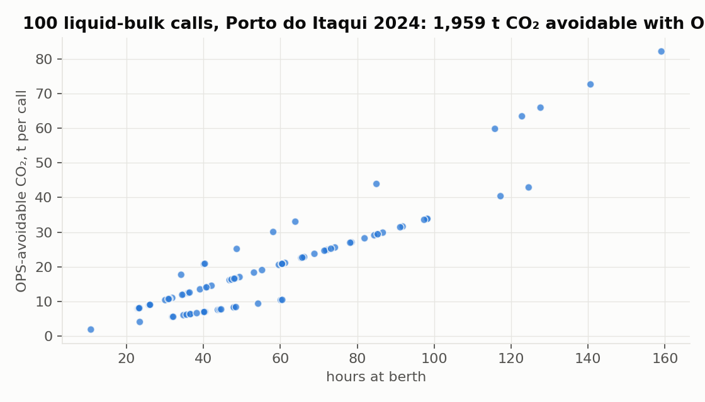
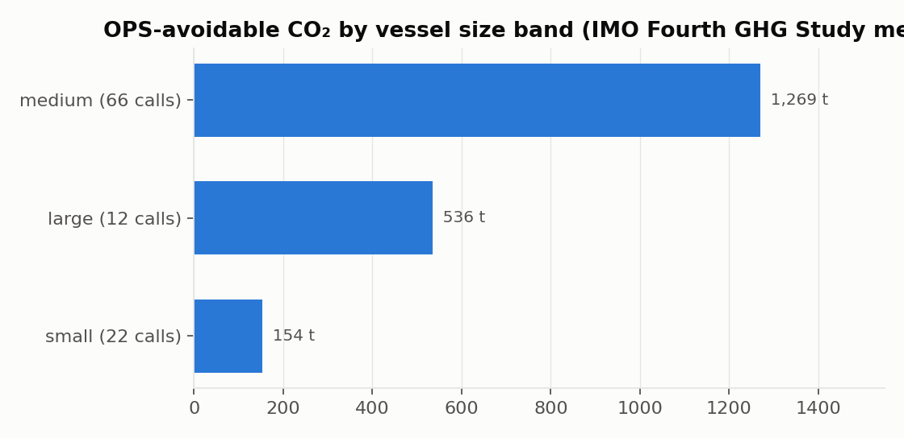

# maritime-co2

**Open, citable Python library to estimate the at-berth CO₂ that Onshore Power Supply (OPS) would avoid for liquid bulk (tanker) vessels, following the IMO Fourth Greenhouse Gas Study (2020) method**

[](https://doi.org/10.5281/zenodo.20708090)
[](LICENSE)
[](https://www.python.org)
[](tests/)
[](https://www.decarbport.com)

<p align="center">
  
</p>

## What this is

When a ship connects to shore power at berth, it shuts down its **auxiliary engines**. The CO₂ that OPS avoids is therefore the auxiliary-engine emission during the stay. `maritime-co2` computes it call by call from operational inputs (deadweight, hours at berth) with transparent, standard parameters and no proprietary calibration. The same method powers the interactive calculator at [decarbport.com](https://www.decarbport.com).

**Key modelling choice.** OPS replaces the auxiliary-engine (hotelling) load only. **Boilers are excluded**: at a liquid-bulk terminal the boiler keeps running on fuel for cargo heating and is not supplied by shore power. This follows standard OPS accounting practice.

## Method

```
energy_kWh  = aux_power_kW × load_factor × berth_hours
fuel_tonnes = energy_kWh × SFOC (g/kWh) / 1e6
CO2_avoided = fuel_tonnes × Cf
```

| Parameter | Default | Source |
|---|---|---|
| Carbon factor Cf | MDO/MGO 3.206, HFO 3.114 t CO₂ per t fuel | IMO Fourth GHG Study 2020 |
| SFOC | 215 g/kWh | IMO Fourth GHG Study 2020 |
| Auxiliary power by size band | small (≤ 20k DWT) 500 kW · medium (≤ 60k) 1,000 kW · large 1,500 kW | Illustrative, aligned with the IMO method |
| Load factor at berth | 0.50 | Illustrative |

Auxiliary power and load factor are illustrative defaults, not authoritative for a specific vessel and not calibrated to any private dataset. Validate against the primary sources (IMO Fourth GHG Study 2020; IMO MEPC.391(81)) and your own data before reporting.

## Gallery

| Call by call | By vessel size band |
|---|---|
|  |  |

Figures use the bundled sample of 100 real liquid-bulk calls at Porto do Itaqui in 2024 (about 10% of the port's annual liquid-bulk calls): 1,959 t of OPS-avoidable CO₂ with the default parameters.

## Installation and quick start

```bash
git clone https://github.com/darlianecunha/maritimeco2
cd maritimeco2
pip install -e .
```

```python
import pandas as pd
from maritime_co2 import estimate_ops_savings

calls = pd.read_csv("data/sample/itaqui_liquid_bulk_2024_sample.csv")
result = estimate_ops_savings(calls)
print(result[["call_id", "dwt", "size_band", "berth_hours", "co2_avoided_tonnes"]].head())
print("Total OPS-avoidable CO2:", round(result["co2_avoided_tonnes"].sum(), 1), "t")
```

Tests:

```bash
pip install pytest
pytest
```

## Repository map

| Path | Content |
|---|---|
| `maritime_co2/core.py` | `auxiliary_emissions()` and `estimate_ops_savings()` |
| `maritime_co2/factors.py` | Carbon factors, SFOC and size-band profile (all documented) |
| `data/sample/` | 100 real port calls, Porto do Itaqui 2024 (operational inputs only) |
| `notebooks/01_quickstart.ipynb` | Worked example |
| `tests/` | pytest suite |
| `docs/gallery/` | Figures used in this README |

## Roadmap

- [x] OPS-avoidable at-berth CO₂ for liquid bulk (auxiliary only)
- [ ] Sensitivity analysis over auxiliary power and load factor
- [ ] Cost and payback module for OPS infrastructure
- [ ] Extend to other vessel types

## Related work

- [decarbport.com](https://www.decarbport.com): interactive CO₂ calculator for liquid-bulk vessels (React/TypeScript) built on this method
- [Brazil_Vessel_Call_Intelligence](https://github.com/darlianecunha/Brazil_Vessel_Call_Intelligence): at-berth emissions and OPS potential for 30,972 port calls
- The activity-based approach applied to Porto do Itaqui (2022–2024) received the Best Paper award at the 3rd National Congress Integra Portos, Brazil (2025)

## How to cite

Metadata in [`CITATION.cff`](CITATION.cff).

> Cunha, D. R. (2026). *maritime-co2: OPS-avoidable at-berth CO₂ for liquid bulk (tanker) vessels* (Version 0.1.0) [Software]. Zenodo. https://doi.org/10.5281/zenodo.20708090

## Author and licence

**Darliane Ribeiro Cunha, PhD**. [ribeirocunha.com](https://ribeirocunha.com) · [ORCID 0000-0003-2548-1237](https://orcid.org/0000-0003-2548-1237)

[MIT](LICENSE).
